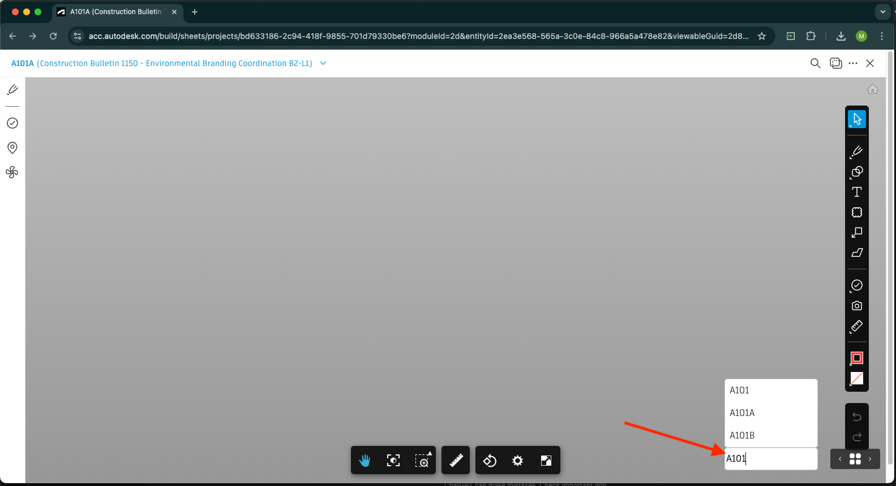
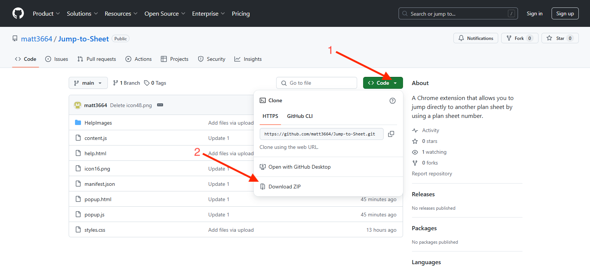
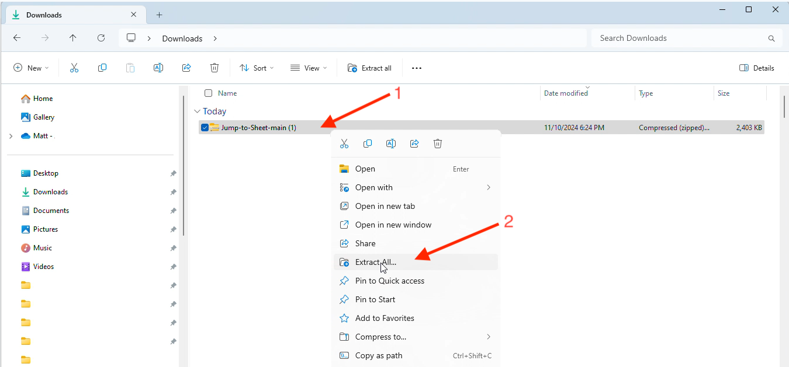
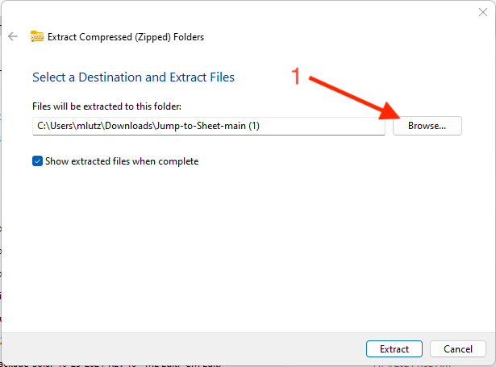
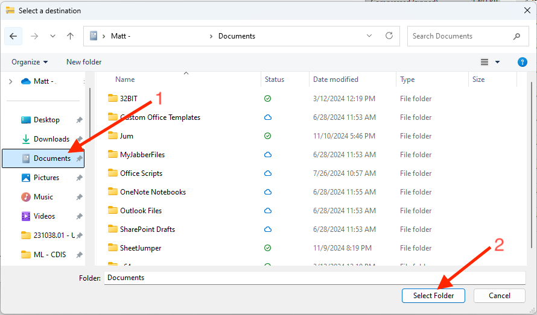
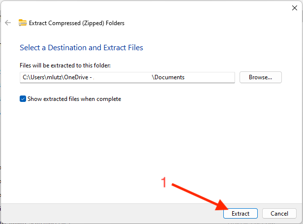
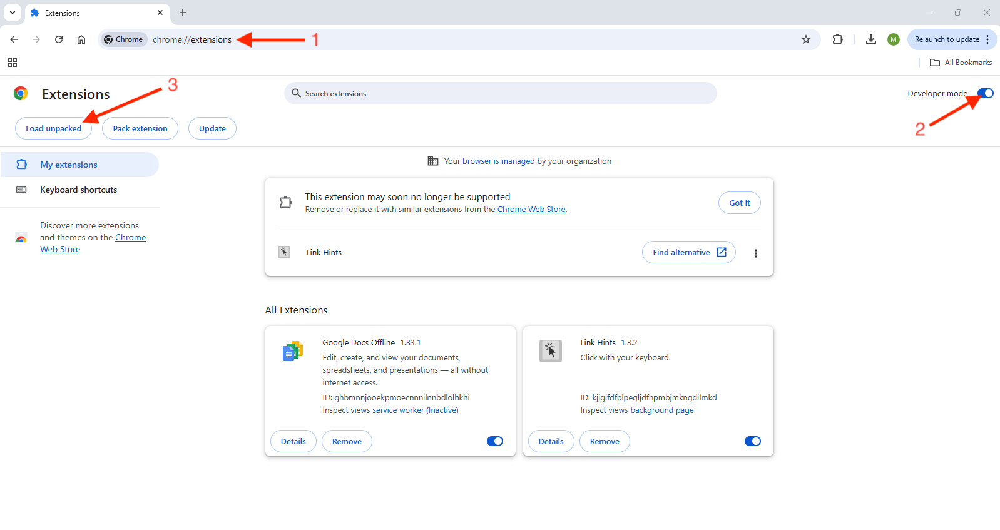
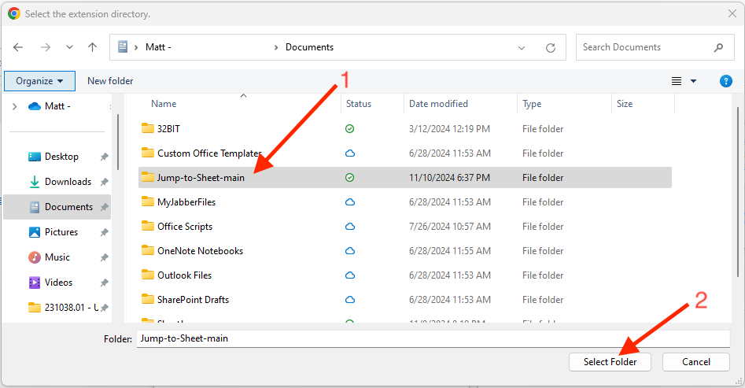
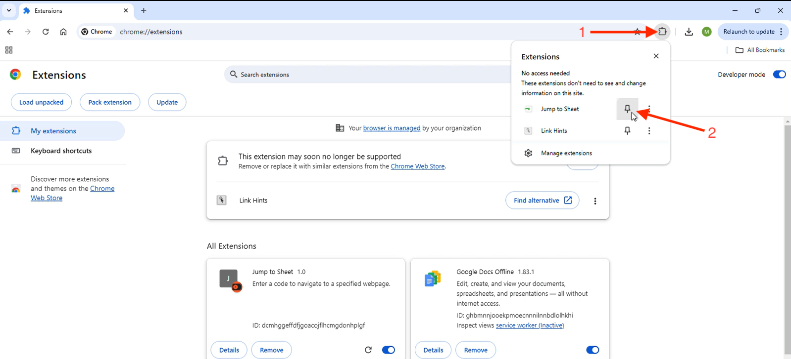
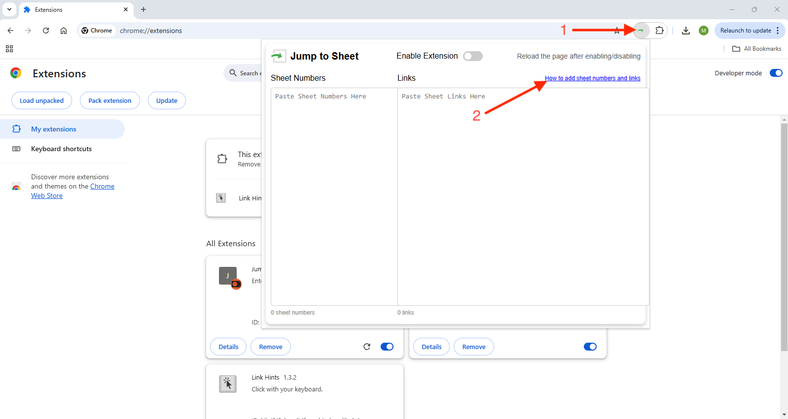

# Jump to Sheet

This extension allows the user to jump from plansheet to plansheet in Autodesk Build using only the sheet numbers. It does this by adding an input box to the bototm right of the Autodesk Build viewer. Setup takes 10 to 15 minutes.

## Installation

1. **Go to the top of this page. Select "Code" and then "Download Zip".**

2. **Go to your download folder. Right click the "Jump-to-Sheet" file. Then select "Extract All".**

3. **Select "Browse".**

4. **Go to you "Documents" folder and then click "Select Folder".**

5. **Select "Extract".**:

6. **Go back to the Chrome browser. Go to the website "chrome://extensions". Turn "Developer Mode" on. Select "Load unpacked".**

7. **Select the "Jump-to-Sheet-main" folder from inside your "Documents" folder. Then click "Select Folder".**

8. **Click the extensions button. Then click the pin next to the "Jump to Sheet" extension.**

9. **Congrats! The extension is now installed. Select the extension and then the "How to" link to learn how to add your project sheets.**

